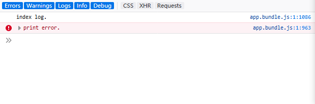
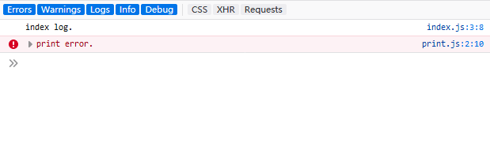

# 开发

## 复习

重新配一遍 webpack

## source map

提供打包后也可以追踪异常定位到原始文件的功能。

### inline-source-map

webpack.config.js

```
module.exports = {
  // ...
  devtool: 'inline-source-map'
}
```

下面分别是 `不使用 source-map` 和 `使用 source-map`：



## 自动编译

自动编译可以省去每次修改代码都需要重新执行一把命令的烦心事。

webpack 有几个不同的选项，可以在代码发生变化后自动编译代码：

1. webpack's Watch Mode
2. webpack-dev-server
3. webpack-dev-middleware

### watch mode(观察模式)

**package.json**

```json
"scripts": {
  "start": "webpack --config webpack.config.js --watch"
},
```

`npm start` 之后保持 terminal 状态，修改代码后，只需要重新刷新页面即可。

### webpack-dev-server(开发服务器)

`webpack-dev-server` 提供一个简单得 web 服务器，能够实施重新加载。

#### 安装

```
npm i webpack-dev-server --save-dev
```

#### webpack.config.js

```
module.exports = {
  // ...
  devServer: {
    contentBase: './dist'
  }
}
```

#### package.json

```
"scripts": {
  "serve": "webpack-dev-server --open"
}
```

#### npm run serve

保存自动刷新，效果还是很棒的。

### webpack-dev-middleware(开发中间件)

`webpack-dev-server` 在内部使用了 `webpack-dev-middleware`，`webpack-dev-middleware` 是一个容器(wrapper)，他把 webpack 处理后的文件传递给一个服务器。

#### 安装

```
npm i express webpack-dev-middleware --save-dev
```

#### webpack.config.js

```
output: {
  // ...
  publicPath: '/'
}
```

#### server.js

[server.js](server.js)

#### package.json

```
"ns": "node server.js"
```

#### npm run ns
