# 弹性布局

W3C 的弹性盒子布局分为`旧版本`, `混合过渡版本`, `新版本`.

## columns 多列布局

[demo](./columns.html)

### 设置列宽

```css
column-width: <length> | auto
```

示例:

```css
body {
  column-width: 200px;
}
```

有一点必须要说明的就是, 设置列宽时虽然写的是 200px, 但是实际上在真正划分列的时候, 渲染引擎会等分整个视窗, 因此 200px 只是表示一个近似值, 实际值可能比 200px 大, 也可能会比他小.

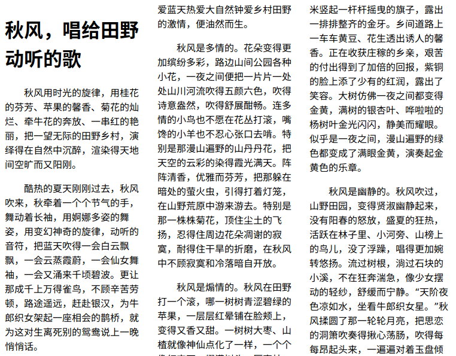

### 设置列数

```css
column-count: <integer> | auto
```

示例:

```css
body {
  column-count: 2;
}
```

设置了列的数量以后, 再设置列的宽度就无效了, 比如如下的设置:

```css
body {
  column-count: 2;
  column-width: 400px;
}
```

无论怎么修改 width 的不会生效了, 它总是会保持 2 列, width 是 auto.

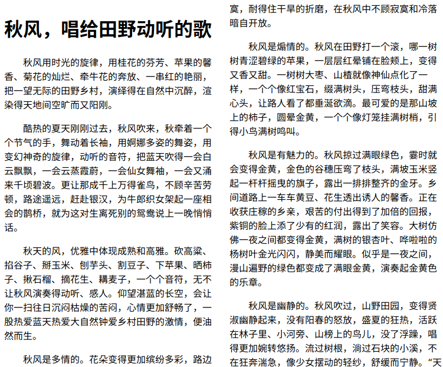

### 设置列间距

```css
column-gap: <length> | normal
```

示例:

```css
body {
  column-count: 2;
  column-gap: 3em;
}
```

上面设置 column-count 的图为没有设置 column-gap, 下面是设置 column-gap: 3em 之后的样子.

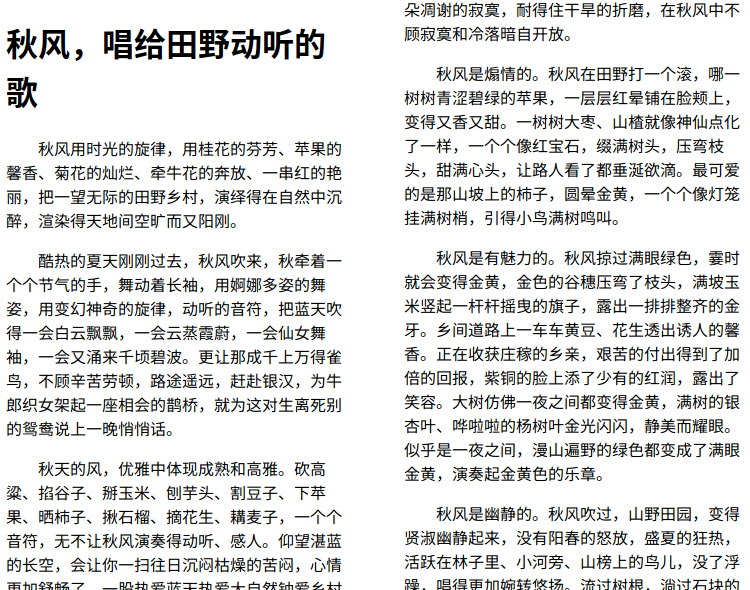

### 设置列边框

```css
column-rule: <column-rule-width> | <column-rule-style> | <column-rule-color>
```

这么看起来太过麻烦了, 实际上和 `border` 的用法是一样的.

示例:

```css
body {
  column-count: 3;
  column-gap: 3em;
  column-rule: 1px dashed #333;
  line-height: 1.7em;
}
```

效果如下:

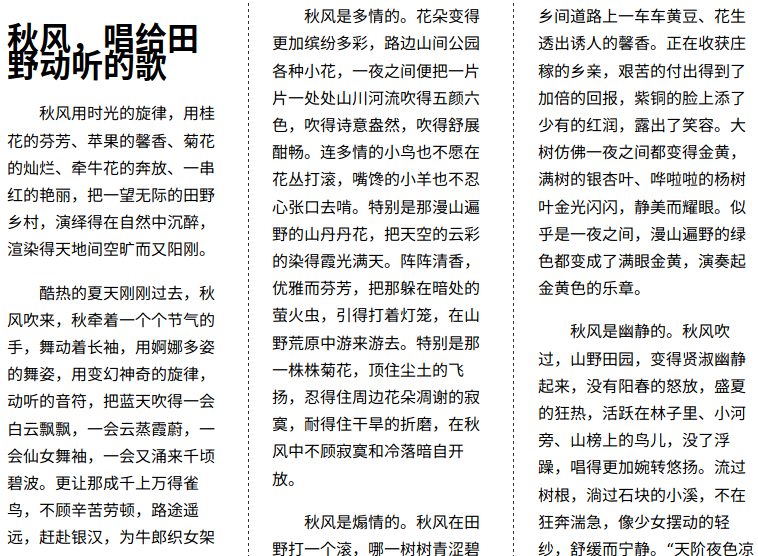

和 border 一样, column-rule 也可以分开来分别设置:

- column-rule-width: 1px;
- column-rule-style: dashed;
- column-rule-color: #333;

### 设置跨列

```css
column-span: none | all
```

- none: 不跨列
- all: 跨所有列

示例:

```css
h1 {
  column-span: all;
  text-align: center;
}
```

效果如下:

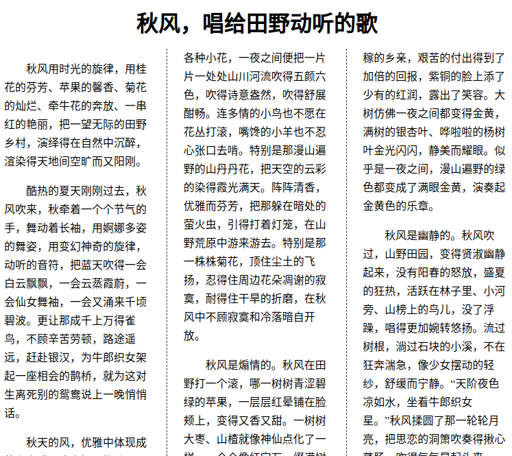

遗憾的是, firefox 并不支持 column-span 属性, 截图来自 chrome.

### 设置列高

```css
column-fill: auto | balance
```

根据理解, column-fill 更适合与叫做`填充列`, 他的预期表现是 auto 则每列的内容高度不一定均衡, balance 时尽量保持每列内容高度均衡.

不过!

我的环境是 ubuntu, firefox, chrome, 完全看不出区别的说! 甚至 firefox 使用 column-fill: auto 时, 莫名的变为单列显示.

## 旧版本 flexbox

启动旧版本的 flexbox, 需要设置 display: box | inline-box.

旧版本的 flexbox 需要用到各个浏览器的私有属性.

flexbox 由子父容器成对出现, 父容器设置 display: box | inline-box 启动 flexbox 功能; 子容器设置 box-flex 属性定义布局信息.

> 盒子的大小 = 父容器的大小 × 盒子的 box-flex / 所有盒子的 box-flex 值的和

### 开启 box 模式

说起来, ie 并不支持 box 模式, 所以这里只有 moz&webkit, 另外, 子父元素都需要分别设置哦.

```css
.box {
  display: -moz-box;
  display: -webkit-box;
  height: 100px;
}

.box-item {
  -moz-box-flex: 1;
  -webkit-box-flex: 1;
}
```

### 设置子元素宽度占比

```css
.box-item {
  -moz-box-flex: 1;
  -webkit-box-flex: 1;
}
```

如果全部子元素都是 1 的话, 那么最终所有子元素的宽度将会是等分的, 也就是一样宽. 它适用于上面提到的盒子大小计算公式:

```css
盒子的大小 = 父容器的大小 × 1 / (1 + 1 + ... + 1)
```

不过实际上在一个 box 父容器中, 并不一定就只能放入 box-item, 你也可以直接放一个 div 进去, 这时候情况就有点不太一样了.

div 如果有尺寸的话, 即便是没有设置为 box-item, 它本身的表现也很像一个 ordinal 为 1 的 box-item. 而此时设置了 box-item 的子元素的尺寸, 将会是如下这样:

```css
box-item 元素的尺寸 = (父容器的尺寸 - 非 box-item 元素的尺寸) × 1 / (1 + 1 + ... + 1)
```

它看起来是这样的: 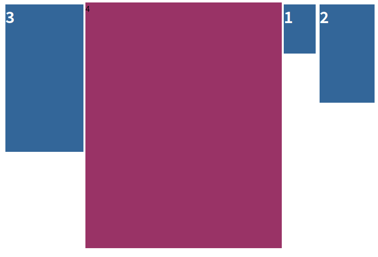

红色区域是一个单纯的 division, 设置为行内样式: `<div style="width: 400px;background-color: #936;">4</div>`

### 设置子元素顺序

```css
.box-item {
  -moz-box-ordinal-group: 3;
  -webkit-box-ordinal-group: 3;
}
```

值越大, 排列的越靠后, 默认不做设置时, 都是 1.

来看一个 demo 的效果吧:

```html
<!DOCTYPE html>
<html lang="en">

<head>
  <meta charset="UTF-8">
  <meta name="viewport" content="width=device-width, initial-scale=1.0">
  <meta http-equiv="X-UA-Compatible" content="ie=edge">
  <title>box</title>
  <style>
    body {
      font-family: '微软雅黑', sans-serif;
    }

    .box {
      display: -moz-box;
      display: -webkit-box;
      height: 500px;
    }

    .box-item-size-1,
    .box-item-size-2,
    .box-item-size-3,
    .box-item-size-default {
      -moz-box-ordinal-group: 4;
      -webkit-box-ordinal-group: 4;
      background-color: #369;
      margin: 4px;
      color: #fff;
      font-size: 2em;
      font-weight: 600;
    }

    .box-item-size-1 {
      -moz-box-flex: 1;
      -webkit-box-flex: 1;
      height: 100px;
    }

    .box-item-size-2 {
      -moz-box-flex: 2;
      -webkit-box-flex: 2;
      height: 200px;
    }

    .box-item-size-3 {
      -moz-box-flex: 3;
      -webkit-box-flex: 3;
      -moz-box-ordinal-group: 1;
      -webkit-box-ordinal-group: 1;
      height: 300px;
    }

    .box-item-size-default {
      -moz-box-flex: 5;
      -webkit-box-flex: 5;
      -moz-box-ordinal-group: 3;
      -webkit-box-ordinal-group: 3;
    }
  </style>
</head>

<body>
  <div class="box">
    <div class="box-item-size-1">1</div>
    <div class="box-item-size-2">2</div>
    <div class="box-item-size-3">3</div>
    <div class="box-item-size-default">4</div>
  </div>
</body>

</html>
```

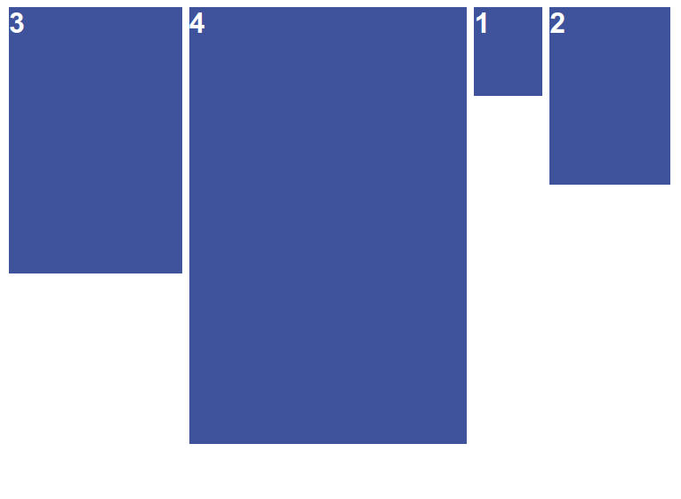

## 新版本 flexbox

同旧版本的 display: box 一样, 新的 flexbox 也是由容器和项组成的.

使用 display: flex | inline-flex 可以启用新版的伸缩盒子.

常规布局是基于块和文档流的, 一般为从左到右, 从上到下; 而 Flex 布局则是基于 flex-item 和 flex-flow 流的.

### 术语

- 主轴(main axis)
  - flex-item 主要沿着这条轴进行排列布局, 主轴的方向由 justify-content 属-设置
- 主轴起点(main-start)
  - flex-item 从主轴起点开始布局
- 主轴终点(main-end)
  - flex-item 从主轴起点开始向着主轴终点布局
- 主轴尺寸(main size)
  - flex-item 元素在主轴方向的 width 或 height 就是主轴的尺寸
- 侧轴(cross axis)
  - 侧轴垂直于主轴, 它的方向主要取决于主轴的方向, 侧轴实际上决定的是行(列)的扩-方向
- 侧轴起点(cross-start)
  - 同样主要是决定了本轴的排布方向
- 侧轴终点(cross-end)
  - 同样主要是决定了本轴的排布方向
- 侧轴尺寸(cross size)
  - flex-item 在侧轴方向的 width 或 height 就是侧轴的尺寸

### flex 特性

通过设置 `display: flex`, 可以使一个容器的内部采用 flex 流的方式布局. 在一个设置了 `display: flex | inline-flex` 的容器内部, 无论是行内元素, 块级元素, 都将使用 flex 流的布局方式, 如图所示.

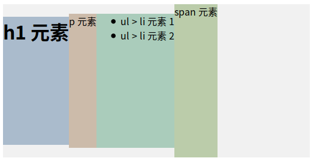

> columns 属性对 flex 容器是无效的

每个元素都默认沾满了 flex 容器的整个高度, 但是容器的宽度并未沾满, 那么如果沾满了会发生什么呢?

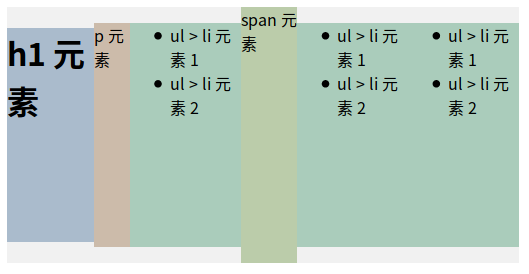

由图可见, 当元素已经占据了整个容器后, 还向容器中添加新的元素的话, 所有元素将会分别让出一些空间个新的元素, 而不是换行.

同时, 如果对容器内的元素设置 float 也是无效的, 此外还包括 clear、vertical-align.

如果想让子元素从上往下排列, 而不是从左往右排列, 就需要设置主轴方向.

### 设置子元素排列方向

设置容器的 flex-direction 可以设置子元素的主轴排列方向, flex-direction 接收 4 中赋值:

- row
- row-reverse
- column
- column-reverse

为了更方便截图, 这里把所有子元素的 margin 统一设置为 0 了, 左侧为 flex-direction: row, 右侧为 column:

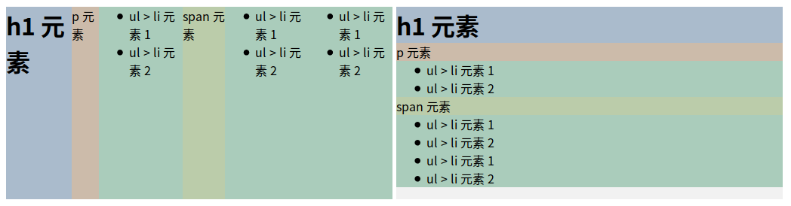

区别是非常明显的.

那么, 如何允许子元素换行(列)显示呢?

### 设置子元素多行(列)布局

flex-wrap 属性定义了 flex 容器是否可以换行(列)显示项目, 而侧轴的方向就决定了新行(列)堆叠的方向.

flex-wrap 支持三个可选值:

- nowrap: 默认方式
- wrap: 支持换行(列)
- wrap-reverse: 反向 wrap

设置 flex-wrap: wrap 效果预览:

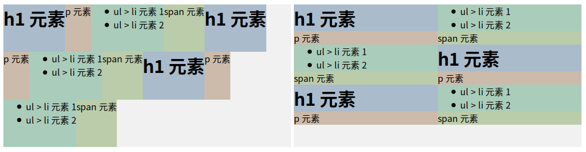

### 设置方向+换行

flex-flow 属性可以同时设置 flex-direction 和 flex-wrap 属性, 语法如下:

```css
flex-flow: flex-direction || flex-wrap
```

例如:

```css
.flex-div {
  flex-flow: row wrap;
}
```

### 设置子元素对齐方式

#### 主轴对齐

可以在 `flex 容器` 中定义 `justify-content` 属性来设置子元素在`主轴`上的对齐方式, 它允许以下 5 种取值:

- flex-start: 默认值, 子元素靠首
  - 如果是 row, 则表示靠左, 如果是 column, 则表示靠上, end 同理
- flex-end: 靠尾
- center: 居中
- space-between: 均匀的空白填充在元素之间
- space-around: 均匀的空白环绕在元素之外

终点看一下 space-between 与 space-around 的区别吧, 左侧 between, 右侧 around:

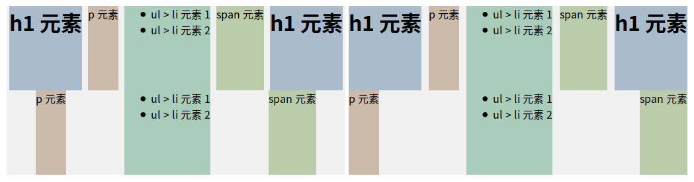

最大的区别就是等分时, 是否包含最两端的空白处.

#### 侧轴对齐

可以在 `flex 容器` 中定义 `align-items` 属性来设置子元素在`侧轴`上的对齐方式, 它允许以下 5 种取值:

- stretch: 默认值, 拉伸占据整个容器
- flex-start: 侧轴靠首
- flex-end: 侧轴靠尾
- center: 侧轴居中
- baseline: 侧轴基准线对齐

下图演示了 flex-start 与 flex-end 的效果:

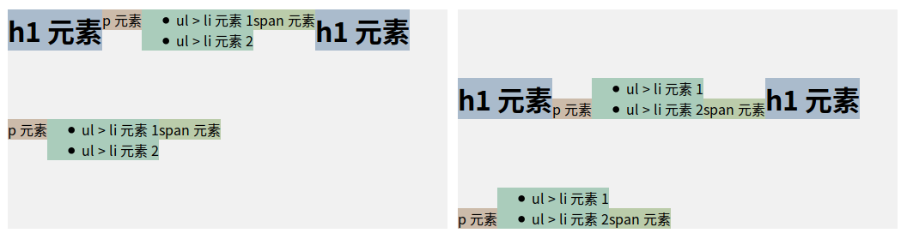

下图演示了 center 与 baseline 的效果:

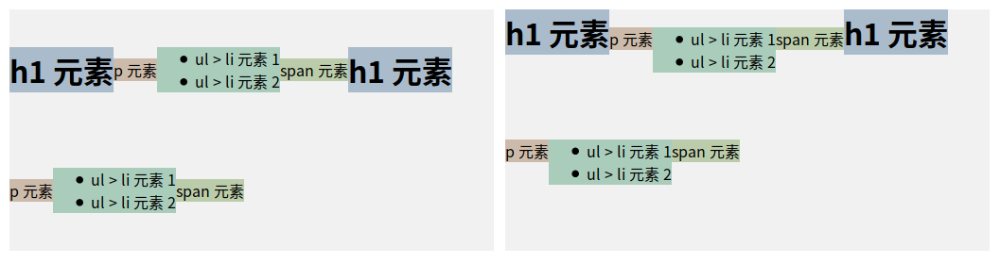

#### 扩展行对齐

> 本属性对只有一行的 flex 容器没有效果

可以在 `flex 容器` 中定义 `align-cotnent` 属性来设置`扩展行`在 `容器` 中的对齐方式, 它允许以下 6 个值:

- stretch: 默认, 拉伸铺满
- center: 居中
- flex-start: 靠首
- flex-end: 靠尾
- space-between: 空白填满
- space-around: 空白环绕

stretch 与 center 效果如下:

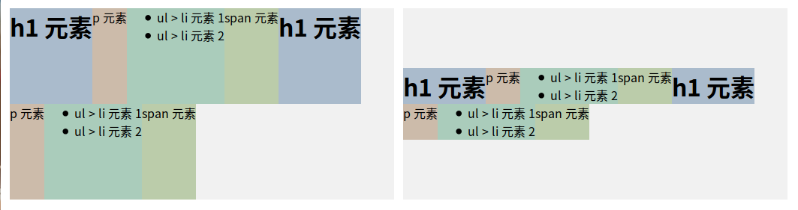

flex-start 与 flex-end 效果如下:

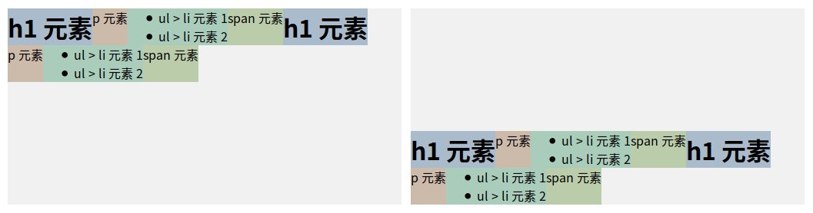

space-between 与 space-around 效果如下:

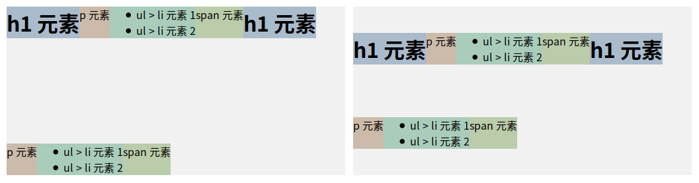

与 justify-content 效果类似.

### 设置子元素

之前看到每个子元素所占据的尺寸都是自适应的, 当然也应该可以主动调整子元素宽高, 或是调整其顺序等.

- 设置排序

order 属性可以控制子元素的显示顺序.

语法: `order: <integer>`, 默认子元素的 order: 1, 值越大排列越靠后, 同 `box-ordinal-group`

```css
.flex-item {
  order: 2;
}
```

- 设置扩展

flex-grow 可以设置子元素的扩展力, 与 `box-flex` 值是一样的效果.

语法: `flex-grow: <number>`, 默认为 1

```css
p {
  flex-grow: 3;
}
```

这么设置也就意味着 p 标签将会占据本行(列)主轴尺寸的其中 3 份, 没有设置的默认占据 1 份.

- 设置收缩

flex-shrink 可以设置子元素的收缩力, 与 `flex-grow` 相反, 理解起来的话, flex-shrink 用来设置元素"至少"要占据多少分, 默认都是 1 份, 而 flex-grow 实际上是最多占据多少份.

语法: `flex-shrink: <number>`, 默认为 1

- 伸缩比率

flex-basis 可以设置伸缩基准值, 剩余的空间按照比率进行伸缩.

语法: `flex-basis: <length> | <percentage> | auto | content`, 说明如下:

- length: 可以是一个 256px
- percentage: 可以是一个 30%
- auto: 自动计算
- content: 根据内容自动计算宽度

设置 `flex-basis: 256px`:

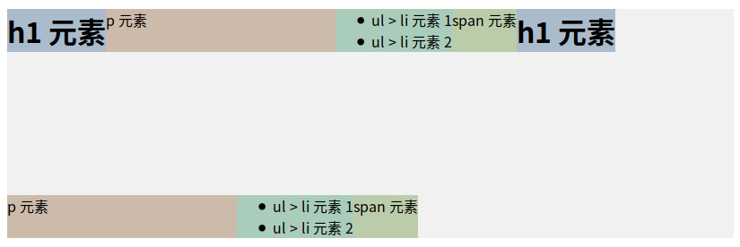

- 复合属性 flex

使用 flex 可以同时设置: flex-grow, flex-shrink, flex-basis

语法: `flex: none | [<flex-grow> <flex-shrink>? || <flex-basis>]`

比如: `flex: 256px;` 或 `flex: 3 2;`

- 对齐方式

可以通过在 `flex 容器元素`设置主轴对齐(justify-content), 侧轴对齐(align-items), 扩展行对齐(align-content)的方式来对齐子元素, 但是也可以在子元素自己设置对齐方式(align-self), 他可以覆盖掉父元素所给定的对齐方式.

align-self 的取值包括:

- stretch: 默认值, 拉伸占据整个容器
- flex-start: 侧轴靠首
- flex-end: 侧轴靠尾
- center: 侧轴居中
- baseline: 侧轴基准线对齐

> 另外, 如果一个 `flex 容器`仅有一个 `flex-item` 的话, 那么将 flex-item 的 margin: auto; 它将会自动上下左右居中.

## 比较新旧 flexbox

### 版本

flexbox 经历了 3 个版本的发展阶段:

- 2009(旧版本): display: box
- 2011(混合版本): display: flexbox
- 2012(新版本): display: flex

考虑到兼容性问题的话, 三种版本都需要写哦.

### 用法

- 新: display: flex | inline-flex
- 混合: display: flexbox | inline-flexbox
- 老: display: box | inline-box

### 对齐

#### 对比主轴对齐

- 新: justify-content: justify-content | flex-start | flext-end | center | space-between | space-around
- 混合: flex-pack: flex-pack | start | end | center | justify | distribute
- 老: box-pack: box-pack | start | end | center | justify

#### 对比侧轴对齐

- 新: align-items: flex-start | flex-end | center | baseline | stretch
- 混合: flex-align: start | end | center | baseline | stretch
- 老: box-align: start | end | center | baseline | stretch

#### 对比扩展行对齐

- 新: align-content: flex-start | flex-end | center | space-between | space-around | stretch
- 混合: flex-line-pack: start | end | center | justify | distribute | stretch
- 老: 无

#### 对比flex-item设置对齐

- 新: align-self: flex-start | flex-end | center | baseline | stretch
- 混合: flex-item-algin: start | end | center | baseline | stretch
- 老: 无

#### 比较排序

- 新: order: number
- 混合: flex-order: number
- 老: box-ordinal-group: integer

#### 比较flex符合属性

- 新: flex: flex-grow flex-shrink || flex-basis
- 混合: flex: pos-flex neg-flex || preferred-size
- 老: box-flex: number

#### 比较flex流方向

- 新: flex-direction: row | row-reverse | column | column-reverse
- 混合: flex-direction: row | row-reverse | column | column-reverse
- 老:
  - box-orient: horizontal | vertical
  - box-direction: normal | reverse

#### 比较换行

- 新: flex-wrap: nowrap | wrap | wrap-reverse
- 混合: flex-wrap: nowrap | wrap | wrap-reverse
- 老: box-lines: single | multiple
