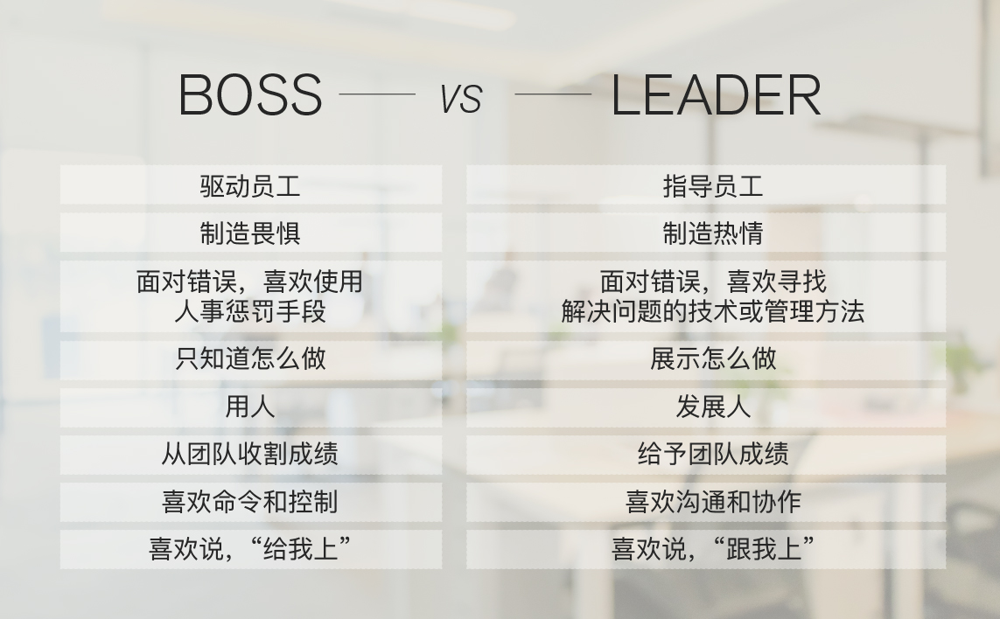

# Leader Or Boss

## 区别

- Boss 驱动员工，Leader 指导员工
- Boss 制造畏惧，Leader 制造热情
- Boss 面对错误，使用惩罚，Leader 面对错误，寻找方案
- Boss 只知道怎么做，Leader 展示怎么做(Lead by example)
- Boos 用人，Leader 带人
- Boss 团队收割成绩，Leader 给予团队成绩
- Boss 喜欢命令和控制，Leader 喜欢沟通与协作
- Boss 喜欢说“给我上”，Leader 喜欢说“跟我上”

## 如何成为一个 Leader

### 技术领导力（Leadership）：

- 帮人解决问题
- 被人依赖

### 非技术力之外：

- 赢得他人的信任
- 开放的心态 + 倾向性的价值观
- Lead by example。做到 **A**lways **B**e **C**oding
- 保持热情和冲劲
- 抓住重点，看透本质
- 描绘令人激动的方向，提供令人向往的环境
- 甘当铺路石，为他人创造机会
